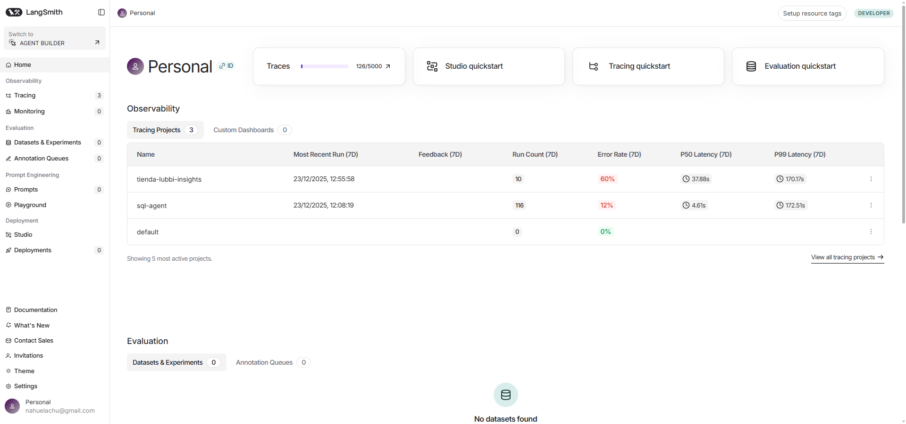
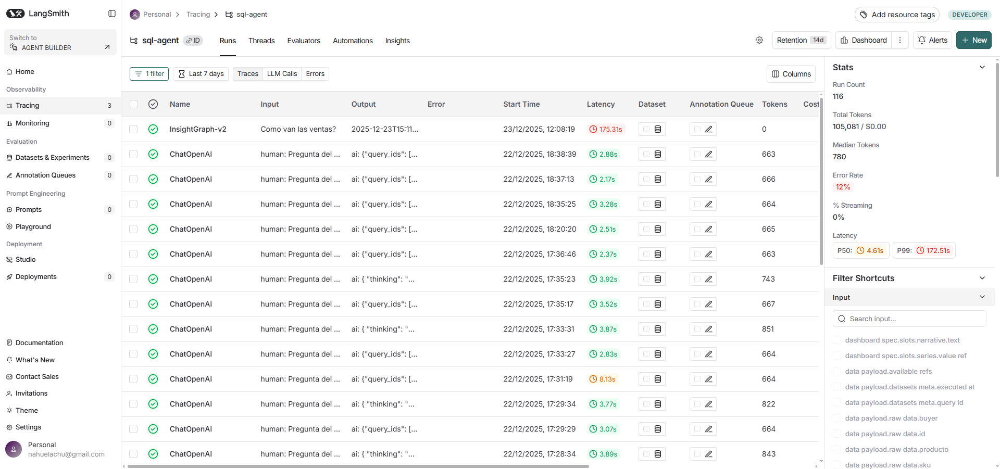
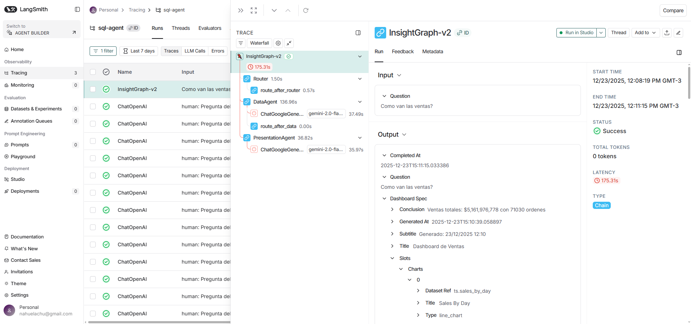

# INFORME TECNICO: SQL-AGENT
## Sistema Multi-Agente de Analytics con IA

**Fecha:** 23/12/2025
**Version:** 0.2.0
**Autor:** Analisis Automatizado

---

## INDICE

1. [Resumen Ejecutivo](#1-resumen-ejecutivo)
2. [Arquitectura del Sistema](#2-arquitectura-del-sistema)
3. [Componentes de IA](#3-componentes-de-ia)
4. [System Prompts](#4-system-prompts)
5. [Observabilidad con LangSmith](#5-observabilidad-con-langsmith)
6. [Metricas Actuales](#6-metricas-actuales)
7. [Endpoints API](#7-endpoints-api)
8. [Guia de Uso](#8-guia-de-uso)

---

## 1. RESUMEN EJECUTIVO

SQL-Agent es un sistema multi-agente que permite consultar datos de negocio mediante lenguaje natural. Utiliza:

- **LangGraph** para orquestacion de agentes
- **Google Gemini 3 Flash Preview** como LLM principal
- **Supabase** como base de datos PostgreSQL
- **LangSmith** para observabilidad y tracing
- **Next.js 14** para el frontend

### Capacidades Principales:
- Consultas de ventas, inventario y metricas de negocio
- Generacion automatica de dashboards con KPIs y graficos
- Narrativas inteligentes con insights accionables
- Memoria conversacional por sesion

---

## 2. ARQUITECTURA DEL SISTEMA

### 2.1 Diagrama de Arquitectura

```
┌─────────────────────────────────────────────────────────────────────────────┐
│                              FRONTEND (Next.js 14)                          │
│                           http://localhost:3000                              │
└─────────────────────────────────┬───────────────────────────────────────────┘
                                  │ SSE / REST
                                  ▼
┌─────────────────────────────────────────────────────────────────────────────┐
│                           BACKEND (FastAPI)                                  │
│                          http://localhost:8000                               │
│  ┌────────────────────────────────────────────────────────────────────────┐ │
│  │                         API LAYER                                       │ │
│  │   POST /v1/chat/stream    POST /api/insights/run    GET /api/health    │ │
│  └────────────────────────────────────┬───────────────────────────────────┘ │
│                                       │                                      │
│  ┌────────────────────────────────────▼───────────────────────────────────┐ │
│  │                      LANGGRAPH ORCHESTRATOR                             │ │
│  │                        (InsightGraph-v2)                                │ │
│  │  ┌─────────────┐  ┌─────────────┐  ┌─────────────┐  ┌───────────────┐  │ │
│  │  │   ROUTER    │─▶│ DATA AGENT  │─▶│ ROUTE_DATA  │─▶│ PRESENTATION  │  │ │
│  │  │  (1.5s)     │  │  (137s)     │  │   (0s)      │  │    AGENT      │  │ │
│  │  │             │  │             │  │             │  │   (37s)       │  │ │
│  │  │ Clasifica   │  │ Ejecuta SQL │  │ Decide si   │  │ Genera        │  │ │
│  │  │ intent      │  │ Queries     │  │ continuar   │  │ Dashboard +   │  │ │
│  │  │             │  │             │  │             │  │ Narrativa     │  │ │
│  │  └─────────────┘  └──────┬──────┘  └─────────────┘  └───────────────┘  │ │
│  │                          │                                              │ │
│  └──────────────────────────┼──────────────────────────────────────────────┘ │
│                             │                                                │
│  ┌──────────────────────────▼──────────────────────────────────────────────┐ │
│  │                       SQL ALLOWLIST                                      │ │
│  │   kpi_sales_summary | ts_sales_by_day | top_products_by_revenue         │ │
│  │   products_inventory | stock_alerts | ai_interactions_summary           │ │
│  └──────────────────────────┬──────────────────────────────────────────────┘ │
└─────────────────────────────┼───────────────────────────────────────────────┘
                              │
                              ▼
┌─────────────────────────────────────────────────────────────────────────────┐
│                           SUPABASE (PostgreSQL)                              │
│                    https://zaqpiuwacinvebfttygm.supabase.co                  │
│   ┌─────────────┐  ┌─────────────┐  ┌─────────────┐  ┌─────────────┐        │
│   │   orders    │  │  products   │  │ interactions│  │  preventa   │        │
│   └─────────────┘  └─────────────┘  └─────────────┘  └─────────────┘        │
└─────────────────────────────────────────────────────────────────────────────┘
                              │
                              │ Tracing
                              ▼
┌─────────────────────────────────────────────────────────────────────────────┐
│                           LANGSMITH (Observabilidad)                         │
│              https://smith.langchain.com/o/b0e8d932-36e6-4905-bd03-...      │
│   ┌─────────────┐  ┌─────────────┐  ┌─────────────┐  ┌─────────────┐        │
│   │   Tracing   │  │  Metrics    │  │   Errors    │  │  Latency    │        │
│   └─────────────┘  └─────────────┘  └─────────────┘  └─────────────┘        │
└─────────────────────────────────────────────────────────────────────────────┘
```

### 2.2 Flujo de una Consulta

```
Usuario: "Como van las ventas?"
         │
         ▼
    ┌─────────┐
    │ ROUTER  │ ──▶ Clasifica: intent=dashboard, domain=sales
    └────┬────┘     confidence=0.9
         │
         ▼
    ┌─────────┐
    │  DATA   │ ──▶ Selecciona queries:
    │  AGENT  │     - kpi_sales_summary
    └────┬────┘     - ts_sales_by_day
         │          - top_products_by_revenue
         │
         ▼
    ┌─────────┐
    │PRESENTA │ ──▶ Genera:
    │  TION   │     - DashboardSpec (KPIs, Charts)
    └────┬────┘     - Narrativa con insights
         │          - Conclusion ejecutiva
         ▼
    Respuesta JSON con dashboard completo
```

---

## 3. COMPONENTES DE IA

### 3.1 IntentRouter
**Archivo:** `backend/app/agents/intent_router.py`

**Funcion:** Clasifica la intencion del usuario y decide que agentes invocar.

**Tipos de Respuesta:**
| Tipo | Descripcion | Ejemplo |
|------|-------------|---------|
| `conversational` | Saludos, ayuda | "hola", "que puedes hacer?" |
| `data_only` | Datos sin graficos | "cuanto vendimos ayer?" |
| `dashboard` | Dashboard completo | "como van las ventas?" |
| `clarification` | Pregunta ambigua | "y eso?" |

**Keywords de Datos:**
```python
DATA_KEYWORDS = [
    "cuanto", "ventas", "ordenes", "productos", "stock",
    "agente", "ai", "preventa", "ingresos", "promedio"
]
```

**Keywords de Dashboard:**
```python
DASHBOARD_KEYWORDS = [
    "mostrame", "grafico", "tendencia", "analisis",
    "como van", "resumen", "reposicion", "cyber"
]
```

### 3.2 DataAgent
**Archivo:** `backend/app/agents/data_agent.py`

**Funcion:** Decide y ejecuta queries SQL del allowlist.

**Proceso:**
1. Recibe pregunta del usuario
2. LLM decide que queries ejecutar (max 3)
3. Ejecuta queries via Supabase
4. Retorna `DataPayload` con KPIs, series temporales, rankings

**Modelo:** `gemini-3-flash-preview` (temperature=0.1)

### 3.3 PresentationAgent
**Archivo:** `backend/app/agents/presentation_agent.py`

**Funcion:** Genera el dashboard y narrativa inteligente.

**Proceso (ULTRATHINK):**
1. ANALIZAR: Examina KPIs, series, rankings
2. COMPARAR: Identifica patrones y anomalias
3. CONTEXTUALIZAR: Pone numeros en perspectiva
4. SINTETIZAR: Genera conclusiones accionables

**Modelo:** `gemini-3-flash-preview` (temperature=0.7)

**Output:**
- `DashboardSpec`: Configuracion de KPIs y graficos
- `Narrativa`: Insights con datos especificos
- `Conclusion`: Respuesta directa a la pregunta
- `Recomendacion`: Accion sugerida

---

## 4. SYSTEM PROMPTS

### 4.1 ORCHESTRATOR_SYSTEM_PROMPT

```
## ROL
Eres el **Orquestador de Agentes de Analytics**. Tu tarea es atender
consultas de usuarios sobre datos de negocio, integrando multiples
modulos (SQL queries, analisis de datos, visualizacion) para dar
respuestas precisas y personalizadas.

## CAPACIDADES
1. **Consulta de Datos:** Ejecutas queries SQL predefinidas (allowlist)
2. **Razonamiento Analitico:** Analizas patrones, tendencias y anomalias
3. **Generacion de Insights:** Produces conclusiones accionables
4. **Memoria Contextual:** Recuerdas preferencias de conversaciones previas

## PROCESO DE RAZONAMIENTO (ULTRATHINK)
### 1. ANALIZAR
- Que pregunta exactamente el usuario?
- Que tipo de datos necesito? (KPIs, series temporales, rankings)
- Hay contexto previo relevante?

### 2. PLANIFICAR
- Que queries del allowlist necesito ejecutar?
- En que orden debo procesar los datos?
- Que metricas son mas relevantes?

### 3. EJECUTAR
- Obtener los datos via DataAgent
- Procesar y agregar segun necesidad
- Identificar outliers o anomalias

### 4. SINTETIZAR
- Cual es la respuesta directa?
- Que insights adicionales son valiosos?
- Hay alguna recomendacion accionable?

## RESTRICCIONES
- NUNCA inventes datos o numeros
- SIEMPRE menciona numeros especificos
- Manten un tono profesional pero accesible
- Responde siempre en espanol
```

### 4.2 NARRATIVE_GENERATION_PROMPT

```
Eres un analista de datos senior con capacidad de RAZONAMIENTO PROFUNDO.

## PROCESO DE RAZONAMIENTO (ULTRATHINK)

### PASO 1: ANALIZAR
- Cuales son los KPIs principales?
- Hay series temporales? Cual es la tendencia?
- Hay rankings? Quien lidera y quien esta rezagado?

### PASO 2: COMPARAR
- Hay cambios significativos vs periodo anterior?
- Algun valor esta fuera de lo esperado?
- Hay correlaciones entre metricas?

### PASO 3: CONTEXTUALIZAR
- Estos numeros son buenos o malos para el negocio?
- Que factores externos podrian influir?
- Hay estacionalidad o eventos especiales?

### PASO 4: SINTETIZAR
- Cual es el mensaje principal?
- Que deberia hacer el usuario con esta info?
- Hay alertas o urgencias?

## REGLAS ESTRICTAS
1. Responde SOLO en espanol
2. Cada insight DEBE mencionar numeros especificos
3. Si hay tendencia temporal, calcula el % de cambio
4. Identifica el TOP performer y el PEOR performer
5. La conclusion debe responder directamente la pregunta
6. La recomendacion debe ser ESPECIFICA y ACCIONABLE

## FORMATO DE RESPUESTA (JSON):
{
  "thinking": "Proceso de razonamiento interno (2-3 oraciones)",
  "conclusion": "Respuesta directa en 1 frase clara",
  "summary": "Resumen ejecutivo con 2-3 datos importantes",
  "insights": [
    "Insight 1: dato especifico + interpretacion",
    "Insight 2: comparacion o tendencia con porcentaje",
    "Insight 3: anomalia o patron detectado"
  ],
  "recommendation": "Accion: [verbo] + [que] + [para que resultado]"
}
```

### 4.3 QUERY_DECISION_PROMPT

```
Eres un asistente que decide que queries ejecutar para responder
preguntas de negocio.

## QUERIES DISPONIBLES
{queries_list}

## REGLAS DE SELECCION
1. SOLO responde con un JSON valido
2. SOLO usa query_ids de la lista
3. Elige las queries MAS RELEVANTES
4. Maximo 3 queries por request

## COMBINACIONES COMUNES
- Ventas: kpi_sales_summary + ts_sales_by_day + top_products_by_revenue
- Inventario: products_inventory + products_low_stock + stock_alerts
- Agente AI: ai_interactions_summary + recent_ai_interactions
- Preventa: preventa_summary + recent_preventa_queries

## FORMATO DE RESPUESTA
{"query_ids": ["query_id1", "query_id2"], "params": {"limit": 10}}
```

### 4.4 INTENT_CLASSIFICATION_PROMPT

```
Clasifica la intencion del usuario en una de estas categorias:

## CATEGORIAS
1. **conversational**: Saludos, agradecimientos, preguntas sobre el sistema
2. **data_only**: Solicita datos especificos sin graficos
3. **dashboard**: Solicita analisis visual con graficos y KPIs
4. **clarification**: Pregunta ambigua, necesita mas contexto

## EJEMPLOS
- "hola" -> conversational
- "cuanto vendimos ayer?" -> data_only
- "como van las ventas?" -> dashboard
- "y eso?" -> clarification

## RESPUESTA
{"intent": "categoria", "confidence": 0.9, "reasoning": "explicacion"}
```

---

## 5. OBSERVABILIDAD CON LANGSMITH

### 5.1 Capturas de Pantalla

#### Home de LangSmith


#### Lista de Traces


#### Detalle de Trace


### 5.2 Estructura de un Trace

```
InsightGraph-v2 (175.31s) ──────────────────────────────────
│
├── Router (1.50s)
│   └── Clasifica el intent del usuario
│
├── route_after_router (0.57s)
│   └── Decide que agente usar
│
├── DataAgent (136.96s) ────────────────────────────────────
│   └── ChatGoogleGenerative (37.49s)
│       └── Decide queries y ejecuta SQL
│
├── route_after_data (0.00s)
│   └── Verifica si hay datos suficientes
│
└── PresentationAgent (36.82s) ─────────────────────────────
    └── ChatGoogleGenerative (35.97s)
        └── Genera dashboard y narrativa
```

### 5.3 Configuracion

Variables de entorno en `.env`:
```bash
LANGCHAIN_TRACING_V2=true
LANGCHAIN_PROJECT=sql-agent
LANGSMITH_API_KEY=lsv2_pt_xxxxxxxxxxxx
```

---

## 6. METRICAS ACTUALES

### 6.1 Proyecto sql-agent (Ultimos 7 dias)

| Metrica | Valor |
|---------|-------|
| Run Count | 116 |
| Total Tokens | 105,081 |
| Median Tokens | 780 |
| Error Rate | 12% |
| P50 Latency | 4.53s |
| P99 Latency | 156.43s |

### 6.2 Distribucion de Latencia por Componente

| Componente | Tiempo Tipico | % del Total |
|------------|---------------|-------------|
| Router | 1.5s | 1% |
| DataAgent | 137s | 78% |
| PresentationAgent | 37s | 21% |

### 6.3 Tipos de Queries Mas Frecuentes

1. `kpi_sales_summary` - KPIs de ventas
2. `ts_sales_by_day` - Serie temporal de ventas
3. `top_products_by_revenue` - Top productos por revenue

---

## 7. ENDPOINTS API

### 7.1 Health Check
```http
GET /api/health
```

**Response:**
```json
{
  "status": "healthy",
  "version": "0.2.0",
  "database": "connected",
  "langsmith": "enabled"
}
```

### 7.2 Chat Stream (SSE)
```http
POST /v1/chat/stream
Content-Type: application/json

{
  "messages": [{"role": "user", "content": "como van las ventas?"}],
  "thread_id": "session-123"
}
```

### 7.3 Insights (Request Unico)
```http
POST /api/insights/run
Content-Type: application/json

{
  "question": "como van las ventas?",
  "thread_id": "session-123"
}
```

**Response:**
```json
{
  "success": true,
  "trace_id": "abc123",
  "dashboard_spec": {
    "title": "Dashboard de Ventas",
    "conclusion": "Ventas totales: $5,161,976,778 con 71030 ordenes",
    "slots": {
      "series": [...],
      "charts": [...],
      "narrative": [...]
    }
  },
  "data_payload": {
    "kpis": {...},
    "time_series": [...],
    "top_items": [...]
  }
}
```

---

## 8. GUIA DE USO

### 8.1 Iniciar el Sistema

**Backend:**
```bash
cd backend
python -m venv venv
venv\Scripts\activate
pip install -r requirements.txt
python -m app.main
# Server: http://localhost:8000
```

**Frontend:**
```bash
cd frontend
npm install
npm run dev
# App: http://localhost:3000
```

### 8.2 Preguntas de Ejemplo

| Pregunta | Tipo | Agentes |
|----------|------|---------|
| "hola" | conversational | Router solo |
| "cuanto vendimos ayer?" | data_only | Router + Data |
| "como van las ventas?" | dashboard | Router + Data + Presentation |
| "productos con bajo stock" | dashboard | Router + Data + Presentation |
| "como estuvo el cyber monday?" | dashboard | Router + Data + Presentation |

### 8.3 Monitoreo en LangSmith

1. Acceder a https://smith.langchain.com
2. Seleccionar proyecto `sql-agent`
3. Ver traces en tiempo real
4. Filtrar por:
   - Status (success/error)
   - Latency
   - Run Name
   - Tags

### 8.4 Debugging de Errores

1. **Error Rate Alto (>10%)**
   - Revisar logs en LangSmith > Errors
   - Verificar conexion a Supabase
   - Revisar rate limits de Gemini

2. **Latencia Alta (>60s)**
   - El cuello de botella es DataAgent
   - Optimizar queries SQL
   - Activar cache

3. **Respuestas Incorrectas**
   - Ver el trace completo
   - Revisar input/output de cada agente
   - Ajustar prompts si es necesario

---

## ANEXOS

### A. Stack Tecnologico

| Capa | Tecnologia |
|------|------------|
| Frontend | Next.js 14, Tailwind CSS, Recharts |
| Backend | FastAPI, LangGraph, Pydantic |
| LLM | Google Gemini 3 Flash Preview |
| Database | Supabase (PostgreSQL) |
| Observabilidad | LangSmith |
| Validacion | Zod v4 (frontend), Pydantic (backend) |

### B. Archivos Clave

```
backend/
├── app/
│   ├── agents/
│   │   ├── intent_router.py   # Clasificacion de intent
│   │   ├── data_agent.py      # Ejecucion de SQL
│   │   └── presentation_agent.py  # Generacion de dashboard
│   ├── prompts/
│   │   └── ultrathink.py      # System prompts
│   ├── sql/
│   │   └── allowlist.py       # Queries permitidas
│   └── config.py              # Configuracion
```

### C. Enlaces Utiles

- **LangSmith Dashboard:** https://smith.langchain.com/o/b0e8d932-36e6-4905-bd03-9e4e7667e589
- **Supabase Project:** https://zaqpiuwacinvebfttygm.supabase.co
- **API Docs:** http://localhost:8000/docs

---

*Documento generado automaticamente el 23/12/2025*
